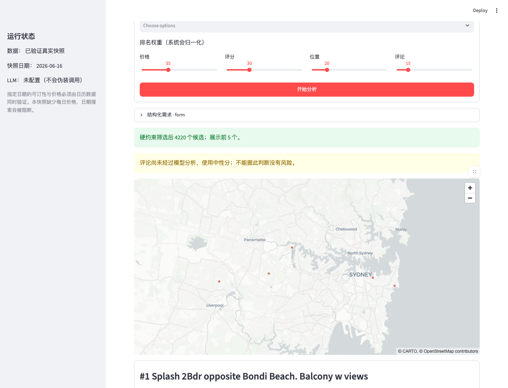

# StayLens Lite — 可审计的 AI 住宿决策与商业分析助手

StayLens 是一个面向 AI 商业分析/数据分析岗位的作品集项目。LLM 只负责意图解析、评论标签和 Text-to-SQL；硬约束、价格、距离、评分和排名由可复核的 SQL/Python 完成。

## 当前交付状态

- **可直接克隆运行**：仓库包含由 Inside Airbnb Sydney `2026-06-16` 真实快照确定性抽样生成的演示库，不包含虚构房源。
- **支持全量模式**：本地可下载并构建 20,573 个房源、7,509,145 条日历和 801,398 条评论的完整数据库。
- **已验证**：单元/集成/安全测试、确定性端到端评测和 Streamlit 程序级冒烟测试均通过；详情见 [`docs/IMPLEMENTATION_STATUS.md`](docs/IMPLEMENTATION_STATUS.md)。
- **真实 LLM 评测**：`gpt-4o-mini` 冻结 final-v2 上，Intent 整题准确率 95%、字段准确率 97.16%（n=100）；Text-to-SQL 状态/执行准确率 96%、输出契约准确率 82%、语义结果一致率 78%（n=50）。评论参考集严格主题+情感微平均 F1 为 63.48%（55 条真实评论、138 个 Codex 辅助整理标签，**不是人工金标准**）。



## 快速运行

```bash
python3 -m venv .venv
source .venv/bin/activate
pip install -r requirements.txt
streamlit run app.py
```

默认优先使用本地全量库 `data/staylens.duckdb`；若不存在，则自动使用仓库内的真实抽样演示库 `data/staylens_demo.duckdb`。

### 构建全量真实数据库

```bash
python scripts/download_data.py
python scripts/build_database.py
```

原始文件的 URL、大小与 SHA-256 会记录在 `data/raw/manifest.json`。完整原始数据和全量 DuckDB 不提交 Git。

### 可选：启用真实 LLM

```bash
cp .env.example .env
# 在 .env 填写 LLM_PROVIDER、LLM_MODEL、LLM_API_KEY
```

密钥不得提交。未配置 Key 时，结构化推荐和内置 SQL 分析仍可运行；自然语言 LLM 功能会明确禁用，不用规则结果冒充模型调用。

## 核心设计

- 硬约束不自动放宽；未知 POI/区域和无法验证的日期价格均失败关闭。
- 价格分使用独立市场可比集，评分使用城市均值贝叶斯收缩。
- 评论标签必须附原文子串证据，并按 review/model/prompt 版本缓存。
- Text-to-SQL 经 AST、表/列/函数白名单、单语句、只读 DuckDB、5 秒中断和 200 行上限。
- 每次推荐保存数据版本、意图、SQL 参数、权重、警告和结果，便于追溯。

评分为 `35% Price + 30% Bayesian Rating + 20% Location + 15% Review`，权重可在界面调整并自动归一化。

## 验证

```bash
pip install -r requirements-dev.txt
pytest -q
python scripts/run_evaluation.py
```

`run_evaluation.py` 不发起付费调用，只汇总已保存的冻结评测报告。方法、样本和失败案例见 [`evaluation/README.md`](evaluation/README.md)、[`evaluation/FINAL_V2_EVALUATION_REPORT.md`](evaluation/FINAL_V2_EVALUATION_REPORT.md) 和 [`evaluation/REVIEW_EVALUATION_REPORT.md`](evaluation/REVIEW_EVALUATION_REPORT.md)。

## 部署

### Streamlit Community Cloud

1. 将仓库推送到 GitHub，确保 `data/staylens_demo.duckdb` 已提交。
2. 在 Streamlit Community Cloud 选择该仓库、分支和入口文件 `app.py`。
3. 如需 LLM 功能，在平台 Secrets 中配置 `LLM_PROVIDER`、`LLM_MODEL` 和 `LLM_API_KEY`；不要上传 `.env`。

### Docker

```bash
docker build -t staylens-lite .
docker run --rm -p 8501:8501 staylens-lite
```

Dockerfile 会携带真实抽样演示库。全量模式可通过卷挂载并设置 `DUCKDB_PATH`；本机尚未安装 Docker，因此镜像构建状态见实现清单。

## 重要限制

- 数据是快照，不是实时库存；`available` 不等于真实入住率或订单。
- 该快照日历没有每日价格列，指定日期价格/总价查询会阻断，绝不以基础价冒充。
- 基础价可能不含税费或清洁费；评论存在选择偏差。
- POI 为人工整理的近似坐标；直线距离不是步行或交通时间。
- 演示库是全量真实快照的确定性抽样，线上结果不代表悉尼全部房源。
- 这是求职作品集分析工具，不是预订建议或生产系统。

## 目录

```text
app.py                  Streamlit 界面
data/                   数据说明、POI 与可部署真实抽样库
scripts/                下载、建库、抽样建库与评测
src/database/           参数化查询和 SQL 安全
src/analytics/          距离、价格、评分、评论风险和排名
src/llm/                LLM 意图、评论和 Text-to-SQL
src/workflow/           状态机与追溯记录
tests/                  单元、集成与安全测试
evaluation/             冻结评测集与真实 API 报告
docs/                   PRD、数据审计与实现状态
```
